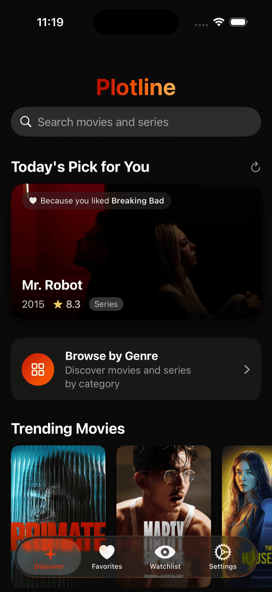
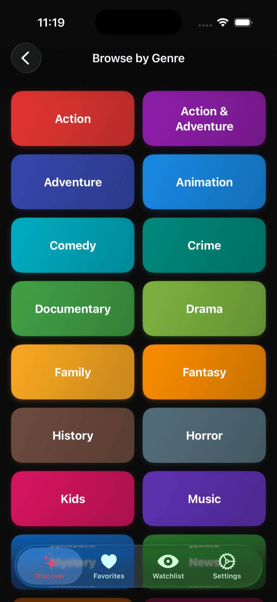
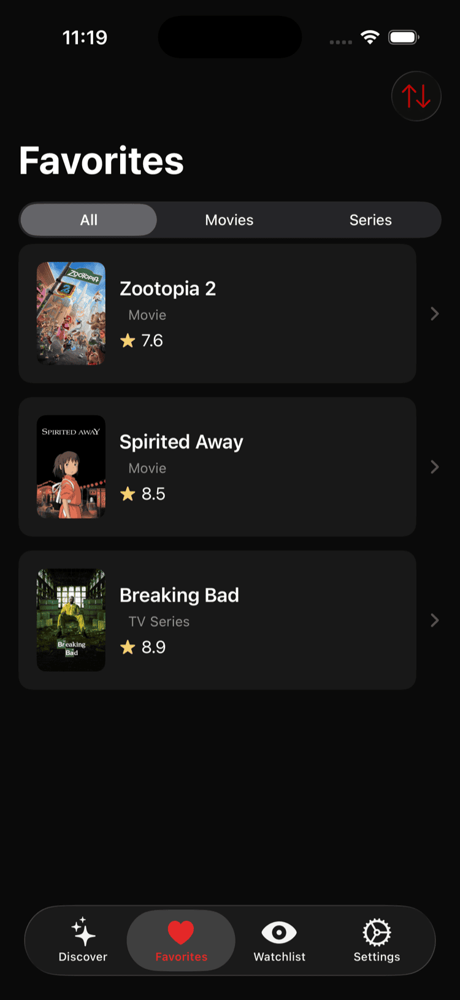
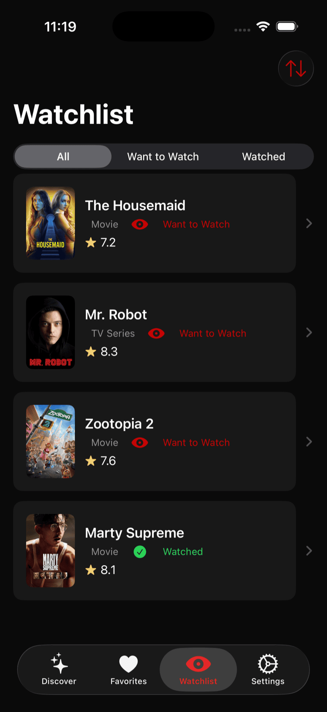
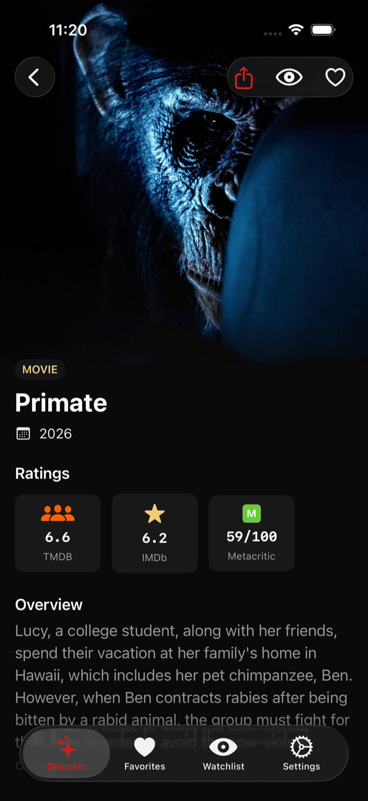
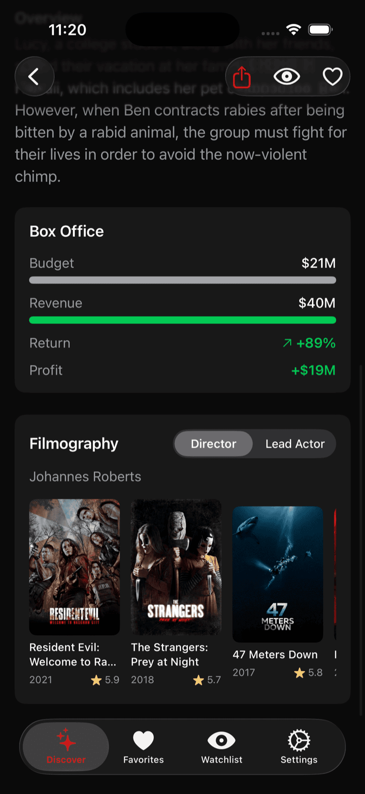

<p align="center">
  
</p>

<h1 align="center">Plotline</h1>

<p align="center">
  <strong>Explore the audiovisual universe with analytical quality visualization</strong>
</p>

<p align="center">
  
  
  
  
  
</p>

## About

**Plotline** goes beyond a simple movie catalog. It provides analytical visualization of quality for both movies and TV series, consolidating critical data from multiple sources (IMDb, Rotten Tomatoes, Metacritic) into a unified, elegant interface.

Most apps tell you *what a series is about*. **Plotline** shows you *how its quality evolves* visually.

## Features

### Discovery
- **Trending & Popular** — Browse trending and top-rated movies & TV series
- **Genre Browsing** — Explore content by genre with filtered results, media type toggle, and sort options
- **Smart Search** — Find any movie or series instantly with real-time results
- **Personalized Daily Pick** — Get daily recommendations based on your favorite genres

### Detail & Analysis
- **Multi-Source Ratings** — Aggregated scores from IMDb, Rotten Tomatoes, and Metacritic
- **Episode Quality Graphs** — Visualize TV series episode ratings with interactive Swift Charts
- **Content Recommendations** — "You Might Also Like" suggestions for every title
- **Share** — Share movies and series with friends via any app

### Collections
- **Favorites** — Save your favorite titles with swipe-to-delete, filtering (All/Movies/Series), and sorting
- **Watchlist** — Track what you want to watch and what you've seen, with status toggling and swipe actions
- **iCloud Sync** — Both favorites and watchlist sync seamlessly across all your devices

### Design
- **Immersive UI** — Cinema-inspired interface with smooth animations and zoom transitions
- **Light & Dark Mode** — Full support for both appearances
- **Dynamic Type** — Adapts to your preferred text size

## Screenshots

<p align="center">
  
  
  
</p>
<p align="center">
  
  
  
</p>

## Tech Stack

| Technology | Purpose |
|------------|---------|
| **SwiftUI** | Declarative UI framework |
| **Swift Charts** | Episode rating visualization |
| **SwiftData** | Local persistence for favorites |
| **CloudKit** | Automatic iCloud sync |
| **@Observable** | iOS 17+ state management |
| **async/await** | Modern concurrency |
| **TMDB API** | Visual data & metadata |
| **OMDb API** | Ratings & episode metrics |

## Architecture

Plotline uses a **dual API strategy** (chained fetching):

1. **TMDB** provides visual assets, trending content, and the `imdb_id` bridge
2. **OMDb** enriches with external ratings and episode-by-episode metrics

```
User Action → TMDB Fetch → Extract imdb_id → OMDb Fetch → Merge & Render
```

## Requirements

- iOS 18.0+
- Xcode 16+
- TMDB API Key ([Get one here](https://www.themoviedb.org/settings/api))
- OMDb API Key ([Get one here](https://www.omdbapi.com/apikey.aspx))
- iCloud account (optional, for cross-device sync)

## Getting Started

1. Clone the repository
   ```bash
   git clone https://github.com/yourusername/Plotline.git
   cd Plotline
   ```

2. Add your API keys to `Plotline/Secrets.plist`:
   ```xml
   <dict>
       <key>TMDB_API_KEY</key>
       <string>your_tmdb_key</string>
       <key>OMDB_API_KEY</key>
       <string>your_omdb_key</string>
   </dict>
   ```

3. Build and run:

   **With Xcode:**
   ```bash
   open Plotline.xcodeproj
   ```
   Then press ⌘R to run.

   **With command line:**
   ```bash
   xcodebuild -project Plotline.xcodeproj -scheme Plotline \
     -destination 'platform=iOS Simulator,name=iPhone 17' \
     -derivedDataPath build build && \
   xcrun simctl install booted build/Build/Products/Debug-iphonesimulator/Plotline.app && \
   xcrun simctl launch booted com.jbgsoft.Plotline
   ```

## Project Structure

```
Plotline/
├── App/                    # App entry point & configuration
├── Models/                 # Data models & API responses
├── ViewModels/             # @Observable view models
├── Views/
│   ├── Discovery/          # Home screen & media cards
│   ├── Detail/             # Media detail & scorecards
│   ├── Graph/              # Series episode charts
│   ├── Favorites/          # Favorites & Watchlist
│   ├── Settings/           # App settings & theme
│   └── Components/         # Reusable UI components
├── Services/               # Network layer, API services & data managers
├── Extensions/             # Swift & SwiftUI extensions
└── Resources/              # Assets & configuration
```

## License

This project is licensed under the MIT License - see the [LICENSE](LICENSE) file for details.

---

<p align="center">
  Made with care by <a href="https://github.com/jaimebg">JBGSoft - Jaime Barreto</a> 🧡
</p>
