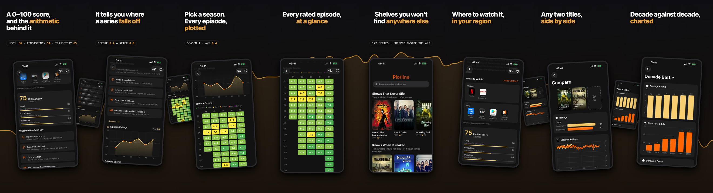

<p align="center">
  
</p>

<h1 align="center">Plotline</h1>

<p align="center">
  <strong>Which seasons are worth it — and the numbers behind that answer</strong>
</p>

<p align="center">
  
  
  
  
  
  
</p>

<p align="center">
  
</p>

## About

**Plotline** is an open-source iOS app for exploring movies and TV series. Metadata, images and ratings come from TMDB — but the catalogue is not the product. Plotline's analysis engine derives what TMDB does not publish: **where a series declines, how consistent it is, whether it lands its ending, and a 0–100 Plotline Score.**

Every verdict is printed with the episode ratings behind it, so you can disagree with it. And when the data will not support a conclusion, the app says so and says why, instead of inventing a softer verdict.

No account, no sign-up, no subscription. 122 fully analysed series ship inside the binary, so it works on a plane.

## What the engine works out

| Output | What it says | What it is grounded in |
|--------|--------------|------------------------|
| **Plotline Score** | A 0–100 rating, broken into **Level**, **Consistency** and **Trajectory** | The three components are shown individually, never just the total |
| **Decline point** | The season after which quality drops and never recovers | The averages before and after, and which seasons fall after it |
| **Consistency** | From remarkably even to a genuine rollercoaster | Spread across reliable episodes, with the highest- and lowest-rated episode named |
| **Opening verdict** | Hooks you early, starts slow, or holds even | Opening episodes against the rest, plus the season a slow start turns around |
| **Ending verdict** | Ends on a high, holds its level, or fades out | Final season against the peak season — only for a series *known* to have finished |
| **Season summaries** | Per-season average, spread, best and worst episode | How many of the aired episodes were reliable enough to count toward it |

`SeriesAnalysisEngine.analyze(episodes:hasEnded:asOf:)` is a pure function over Foundation — no clock, no network, no I/O. Same input, same output. Series with too few reliable episodes return `.insufficientData` with a machine-readable reason, and the UI states that reason.

The engine also identifies episodes that stand out within their season. That output is computed and tested, but not currently surfaced in the UI.

## Features

### Discover
- **Analysis-derived shelves** — *Shows That Never Slip*, *Knows When It Peaked*, *Worth the Wait*, *They Stick the Landing*, *Brilliant and Baffling*. Not genres; groups derived by analysing every episode, each with its measurement spelled out
- **Trending & popular** from TMDB, and search across movies and series
- **Browse by genre** with a media-type toggle and sort options
- **What Should I Watch?** — pick a mood and a format, get a match
- **Taste profile & smart lists** — built from your own favorites and watchlist

### On a title
- **Plotline Score** with its three components and the "What the Numbers Say" verdicts
- **Episode ratings chart** per season — Swift Charts, smooth interpolation, touch selection
- **Episode score grid** across every season at a glance
- **Where to watch** by streaming service with a region picker. *Streaming data provided by JustWatch*
- **Box office** for movies (budget, revenue, ROI), **franchise timelines**, cast **filmographies**, and *You Might Also Like*

### Collections
- **Favorites** and **Watchlist** with swipe actions, filtering and status toggling
- **iCloud sync** — SwiftData backed by CloudKit, with a graceful fall back to local storage when iCloud is unavailable

### Stats
- Your counts, completion rate, movies-vs-series split and genre DNA
- **Compare** any two titles side by side — ratings, box office, episode curves
- **Career profiles** for any actor or director, charted over time
- **Decade Battle** and **Franchise Tracker**

### System
- **Siri App Shortcuts** — search Plotline, ask what to watch, show your stats
- **Light and dark**, following the system or overridden in Settings
- **iPhone and iPad** — grids that size themselves from available width, text capped to a readable measure, correct in multitasking splits

## Works before it can reach the network

`Plotline/Resources/PlotlineDataset.json` ships **122 pre-analysed series and five curated lists**. The app renders them in the first frame and offline.

It is a seed and a fallback, **never the truth**: a live recomputation replaces it as soon as fresher episodes arrive — but only when the live result is at least as complete, so a partial fetch can never replace a full analysis with a fragment.

## Tech Stack

| Technology | Purpose |
|------------|---------|
| **SwiftUI** | Declarative UI, `Tab` API, zoom navigation transitions, symbol effects |
| **Swift Charts** | Episode rating curves, career timelines, decade and franchise charts |
| **SwiftData** | Local persistence for favorites and watchlist |
| **CloudKit** | Automatic iCloud sync, with a local-only fallback |
| **App Intents** | Siri shortcuts and system-wide actions |
| **@Observable** | Observation-based state, no `ObservableObject` |
| **Swift actors / async-await** | Thread-safe networking and disk caching |
| **Swift Testing** | The unit suites, in both the app and the generator |
| **TMDB API** | Metadata, images, vote averages and per-episode ratings |

## Architecture

A single upstream API, and one layer of our own on top of it:

```
User action → TMDB fetch → SeriesAnalysisEngine → Render
                  ↑                                  ↑
             DiskCache                    PlotlineDataset.json
        (episodes, rate limits)        (first frame, and offline)
```

```
Plotline/
├── App/                    # Entry point, theme, deep links, secrets
├── Models/                 # MediaItem, EpisodeMetric, SeriesAnalysis, dataset contract
│   └── APIResponses/       # TMDB response wrappers
├── ViewModels/             # @Observable view models
├── Views/
│   ├── Discovery/          # Feed, search, genres, moods, taste profile
│   ├── Detail/             # Title screen, chart, episode grid, where to watch
│   │   └── Analysis/       # Plotline Score card and verdicts
│   ├── Stats/              # Compare, careers, decade battle, franchise tracker
│   ├── Favorites/          # Favorites and watchlist
│   └── Settings/           # Appearance and app info
├── Services/               # Networking, TMDB, caches, stores
│   └── Analysis/           # SeriesAnalysisEngine — Foundation only
├── Intents/                # App Intents / Siri shortcuts
└── Resources/              # The bundled dataset

Tools/DatasetGenerator/     # SwiftPM tool that regenerates the dataset
Scripts/                    # Release preflight and the App Store screenshot pipeline
docs/app-review/            # Store copy and review notes, versioned with the app
```

Four files — `EpisodeMetric`, `SeriesAnalysis`, `PlotlineDataset` and `SeriesAnalysisEngine` — are compiled by both the app and the dataset generator, via symlinks. **They may import only Foundation.** A reference to SwiftUI or the networking layer in any of them breaks the generator's build.

## Requirements

- iOS 26.0+
- Xcode 26+
- A TMDB API key ([get one here](https://www.themoviedb.org/settings/api)) for live content
- An iCloud account (optional, for cross-device sync)

## Getting Started

1. Clone the repository
   ```bash
   git clone https://github.com/jaimebg/Plotline.git
   cd Plotline
   ```

2. Add your TMDB key to `Plotline/Secrets.plist` (gitignored):
   ```xml
   <dict>
       <key>TMDB_API_KEY</key>
       <string>your_tmdb_key</string>
   </dict>
   ```
   A `TMDB_API_KEY` environment variable works too, if you would rather set it on the scheme.

   **Without a key the app still builds and runs** — the bundled dataset, its shelves and every analysis render as normal. Only live trending, search and images need the network.

3. Build and run:

   **With Xcode:**
   ```bash
   open Plotline.xcodeproj
   ```
   Then press ⌘R.

   **With the command line:**
   ```bash
   xcodebuild -project Plotline.xcodeproj -scheme Plotline \
     -destination 'platform=iOS Simulator,name=iPhone 17' \
     -derivedDataPath build build && \
   xcrun simctl install booted build/Build/Products/Debug-iphonesimulator/Plotline.app && \
   xcrun simctl launch booted com.jbgsoft.Plotline
   ```

## Testing

```bash
# App suites: 146 Swift Testing functions, plus the cold-start UI suite
xcodebuild -project Plotline.xcodeproj -scheme Plotline \
  -destination 'platform=iOS Simulator,name=iPhone 17' test

# The dataset generator's own suite — xcodebuild never runs these
cd Tools/DatasetGenerator && swift test

# Everything that has to be true before a release, in nine steps
./Scripts/release-preflight.sh
```

The cold-start UI suite runs **starved of a TMDB key** on purpose: the bundled dataset has to carry the whole first launch on its own, and the only way to know it still does is to take the network away.

## Screenshots

The store set lives in `screenshots/<version>/` — eight iPhone 6.9" frames and eight iPad 13" frames.

```bash
./Scripts/screenshots/make.sh                     # capture and compose, both device families
./Scripts/screenshots/render.sh iphone-69         # recompose from existing captures
./Scripts/screenshots/readme-strip.sh iphone-69   # rebuild the strip at the top of this file
```

Captures are driven by a UI test that finds elements by label rather than tapping coordinates, then all eight marketing frames are laid out in one HTML row and rendered in a single pass — the rating curve and the device scenes run across frame boundaries, and a sheet that is never separated cannot drift. Which is also why the eight frames rejoin seamlessly into the strip above.

## Contributing

Issues and pull requests are welcome. A few rules this codebase does not bend on:

- **No string may claim more than its predicate establishes.** A decline point proves a relative fall that does not recover; it proves nothing about how good the show was before. An episode below its season average is not "safe to skip".
- **The JustWatch credit stays where it is.** TMDB's terms for the watch-providers endpoint require attributing JustWatch and state that non-compliance revokes API access. The credit is drawn in the same view as the providers so no call site can separate them, and a test reads that view's source to confirm it survives.
- **The four shared files import Foundation and nothing else** — see [Architecture](#architecture).
- **Light mode and iPad are not afterthoughts.** Never `.white` for text, never a hardcoded dark background; check both appearances and both device families.
- [**Conventional Commits**](https://www.conventionalcommits.org/) — `feat:`, `fix:`, `refactor:`, `docs:`, `chore:`.
- Run `./Scripts/release-preflight.sh` before anything that looks like a release.

## Attribution

This product uses the TMDB API but is not endorsed or certified by TMDB.

Streaming availability data is provided by [JustWatch](https://www.justwatch.com/).

## License

MIT — see [LICENSE](LICENSE). The licence covers this source code; the data served through the TMDB API is subject to [TMDB's own terms of use](https://www.themoviedb.org/api-terms-of-use).

---

<p align="center">
  Made with care by <a href="https://github.com/jaimebg">JBGSoft - Jaime Barreto</a> 🧡
</p>
